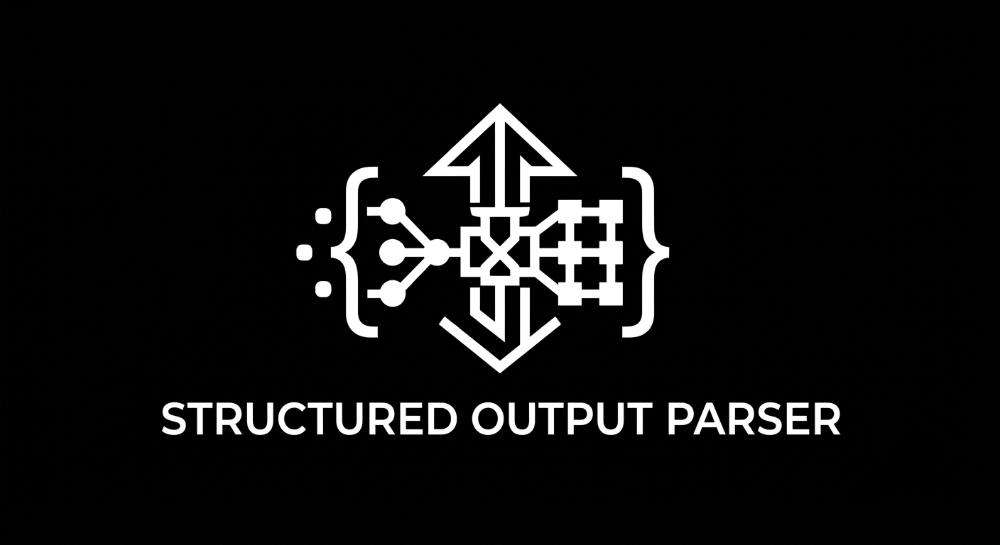

<p align="center">
  
</p>

<h1 align="center">Structured Output Parser</h1>

<p align="center">
  A lightweight, provider-agnostic structured output parser for LLM responses.
</p>

<p align="center">
  
  
  
</p>

## What Is This?

`structured-output-parser` is a lightweight TypeScript library for converting unstructured LLM responses into validated, type-safe structured data.

It takes a schema, generates JSON format instructions for the model, extracts JSON from the response, parses it, and validates the result against the original schema.

The parser itself does not communicate with an LLM.

You choose the provider and SDK, send the generated instructions to the model, and pass the returned text to the parser.

The core problem is simple:

```text
LLM Response
     ↓
JSON Extraction
     ↓
JSON Parsing
     ↓
Schema Validation
     ↓
Typed Result
```

## Why This Project?

LLMs naturally return text, while applications often need predictable structured data.

For example, an application may need:

```ts
{
  name: string;
  age: number;
  occupation: string;
}
```

Instead of manually extracting and validating every response, this library provides a structured pipeline for handling the complete process.

```text
Schema
  ↓
JSON Schema
  ↓
Format Instructions
  ↓
LLM
  ↓
Text Response
  ↓
JSON Extraction
  ↓
JSON.parse()
  ↓
Schema Validation
  ↓
Typed Result
```

The goal is to keep this process small, predictable, provider-agnostic, and easy to integrate.

## Features

* Zod schema validation
* Zod → JSON Schema format instructions
* JSON extraction from plain text
* JSON extraction from Markdown code blocks
* JSON extraction from JSON embedded inside text
* Automatic JSON parsing
* Runtime schema validation
* Typed TypeScript results
* Structured parser errors
* Markdown JSON parser
* Provider-agnostic design
* No LLM provider dependency
* Works with any LLM that returns text
* Edge-case test coverage
* Real LLM integration testing

## Installation

Using Bun:

```bash
bun add structured-output-parser zod
```

Using npm:

```bash
npm install structured-output-parser zod
```

## Basic Usage

Define a schema:

```ts
import { z } from "zod";
import { StructuredOutputParser } from "structured-output-parser";

const schema = z.object({
  name: z.string(),
  age: z.number(),
  occupation: z.string(),
});

const parser = StructuredOutputParser.fromZodSchema(schema);
```

Generate format instructions:

```ts
const instructions = parser.getFormatInstructions();

console.log(instructions);
```

The generated instructions contain a JSON Schema representation of the schema and tell the model how its output should be formatted.

Include the instructions in your LLM prompt:

```ts
const prompt = `
Extract the person's information.

${parser.getFormatInstructions()}

Text:

John is a 25 year old software engineer.
`;
```

After receiving the LLM response:

```ts
const result = await parser.parse(llmResponse);

console.log(result);
```

The result is fully validated and typed:

```ts
{
  name: "John",
  age: 25,
  occupation: "software engineer"
}
```

## How It Works

The parser follows a simple pipeline:

```text
Zod Schema
    ↓
JSON Schema
    ↓
Format Instructions
    ↓
LLM
    ↓
Text Response
    ↓
JSON Extraction
    ↓
JSON.parse()
    ↓
Zod Validation
    ↓
Typed Result
```

### 1. Define a Schema

You define the expected structure using a schema:

```ts
const schema = z.object({
  name: z.string(),
  age: z.number(),
});
```

### 2. Generate Format Instructions

The parser converts the schema into JSON Schema and uses it to generate instructions for the LLM:

```ts
const instructions = parser.getFormatInstructions();
```

### 3. Send Instructions to the LLM

You include those instructions in your prompt using whichever LLM provider you prefer.

### 4. Receive the LLM Response

The provider returns a normal text response.

For example:

```text
Here is the requested information:

{
  "name": "John",
  "age": 25
}
```

### 5. Extract JSON

The parser identifies the JSON object inside the response.

### 6. Parse JSON

The extracted JSON is passed to:

```ts
JSON.parse()
```

### 7. Validate the Result

The parsed value is validated against the original schema.

### 8. Return a Typed Result

The final result preserves the TypeScript type inferred from the schema.

## Format Instructions

One of the main responsibilities of the parser is generating instructions for the LLM.

```ts
const instructions = parser.getFormatInstructions();
```

The generated instructions describe the expected output structure using JSON Schema.

Conceptually:

```text
Schema
   ↓
JSON Schema
   ↓
Format Instructions
```

For example:

```ts
const schema = z.object({
  name: z.string().describe("The person's name"),
  age: z.number().describe("The person's age"),
});
```

The generated instructions contain the corresponding JSON Schema.

You can then include those instructions directly in your prompt:

```ts
const prompt = `
Extract the information.

${parser.getFormatInstructions()}

Return the result according to the requested format.
`;
```

The parser does not send the instructions to an LLM itself.

You control the provider, model, prompt, and API request.

## JSON Extraction

LLMs commonly return JSON in different forms.

### Plain JSON

```json
{
  "name": "John",
  "age": 25
}
```

### Markdown Fenced JSON

````text
```json
{
  "name": "John",
  "age": 25
}
```
````

### JSON Embedded in Text

```text
Here is the requested information:

{
  "name": "John",
  "age": 25
}

I hope this helps.
```

The parser extracts the JSON before passing it to `JSON.parse()`.

Extraction and JSON parsing are intentionally separate responsibilities.

This allows the parser to distinguish between:

```text
JSON could not be extracted
        ↓
INVALID_FORMAT
```

```text
JSON was extracted but is syntactically invalid
        ↓
INVALID_JSON
```

```text
JSON is valid but does not satisfy the schema
        ↓
SCHEMA_VALIDATION
```

## JSON Extraction Strategy

The JSON extractor handles nested objects and arrays while respecting strings and escaped characters.

For example:

```json
{
  "user": {
    "name": "John",
    "metadata": {
      "active": true
    }
  }
}
```

The extractor tracks:

* `{}` object boundaries
* `[]` array boundaries
* Nested structures
* String boundaries
* Escaped characters
* Markdown code blocks

This prevents braces inside strings from being incorrectly interpreted as structural boundaries.

For example:

```json
{
  "message": "Use {value} here"
}
```

The `{value}` inside the string is not treated as a nested JSON object.

## JSON Parsing

After extraction, the parser uses JavaScript's native `JSON.parse()`.

```ts
const parsed = JSON.parse(json);
```

JSON parsing is deliberately kept separate from extraction.

For example, this is syntactically invalid JSON:

```json
{
  "name": "John",
  "age": 25,
}
```

The trailing comma causes `JSON.parse()` to fail.

The parser reports this as:

```text
INVALID_JSON
```

The core parser intentionally does not attempt to automatically repair malformed JSON.

## Schema Validation

The parsed JSON is then validated against the original schema.

For example:

```ts
const schema = z.object({
  name: z.string(),
  age: z.number(),
});
```

This response:

```json
{
  "name": "John",
  "age": "25"
}
```

is valid JSON, but fails schema validation because `age` is a string instead of a number.

The parser reports this as:

```text
SCHEMA_VALIDATION
```

The validation flow is:

```text
JSON
 ↓
JSON.parse()
 ↓
Schema Validation
 ↓
Typed Result
```

## Error Handling

The parser exposes `OutputParserException`:

```ts
import {
  OutputParserException,
} from "structured-output-parser";

try {
  const result = await parser.parse(response);

  console.log(result);
} catch (error) {
  if (error instanceof OutputParserException) {
    console.log(error.code);
    console.log(error.message);
    console.log(error.llmOutput);
    console.log(error.observation);
  }
}
```

### Error Codes

| Code                | Meaning                                     |
| ------------------- | ------------------------------------------- |
| `INVALID_FORMAT`    | JSON could not be extracted                 |
| `INVALID_JSON`      | JSON was extracted but could not be parsed  |
| `SCHEMA_VALIDATION` | JSON was valid but failed schema validation |

### `INVALID_FORMAT`

The parser could not find a complete JSON object or array.

Example:

```text
The answer is:

{
  "name": "John"
```

The JSON structure is incomplete.

### `INVALID_JSON`

A JSON-looking structure was found, but `JSON.parse()` rejected it.

Example:

```json
{
  "name": "John",
}
```

### `SCHEMA_VALIDATION`

The JSON itself was valid, but its structure or values did not satisfy the schema.

Example:

```json
{
  "name": "John",
  "age": "25"
}
```

when the schema expects:

```ts
age: z.number()
```

## Markdown Structured Output

For applications where you specifically want the model to return JSON inside a Markdown code block, use `JsonMarkdownStructuredOutputParser`.

```ts
import { z } from "zod";

import {
  JsonMarkdownStructuredOutputParser,
} from "structured-output-parser";

const parser =
  new JsonMarkdownStructuredOutputParser(
    z.object({
      name: z.string(),
      age: z.number(),
      occupation: z.string(),
    }),
  );
```

Its format instructions request:

````text
Return a markdown code snippet with a JSON object formatted to look like:
```json
{
  ...
}
```
````

The same parsing and validation pipeline is then used:

```ts
const result = await parser.parse(llmResponse);
```

The Markdown parser still uses the same core JSON extraction, parsing, and schema validation flow.

## Creating a Parser from Field Descriptions

For simple string-based schemas, the parser also supports:

```ts
const parser =
  StructuredOutputParser.fromNamesAndDescriptions({
    name: "The person's name",
    occupation: "The person's occupation",
  });
```

This creates an equivalent Zod object schema internally.

For more control, use:

```ts
StructuredOutputParser.fromZodSchema(schema);
```

## TypeScript Types

The parser preserves the inferred Zod type.

```ts
const schema = z.object({
  name: z.string(),
  age: z.number(),
});

const parser =
  StructuredOutputParser.fromZodSchema(schema);

const result = await parser.parse(response);
```

TypeScript understands:

```ts
result.name; // string
result.age;  // number
```

No manual type casting is required.

The type flow is:

```text
Zod Schema
    ↓
z.infer<T>
    ↓
StructuredOutputParser<T>
    ↓
Typed parse() result
```

## Provider Agnostic

The parser does not depend on any specific LLM provider.

You can use it with:

* Groq
* OpenAI
* Anthropic
* Gemini
* Ollama
* Local models
* Custom LLM APIs

The integration pattern is always the same:

```text
LLM Provider
     ↓
   string
     ↓
StructuredOutputParser
     ↓
Validated Object
```

The provider is responsible for generating the response.

The parser is responsible for processing and validating that response.

## Groq Example

The package is provider-agnostic, but the repository contains a Groq integration example using a real LLM response.

Install the SDK:

```bash
bun add -d groq-sdk
```

Set your API key:

```powershell
$env:GROQ_API_KEY="your-api-key"
```

Run:

```bash
bun run examples/groq.ts
```

The example demonstrates:

```text
Zod Schema
    ↓
Format Instructions
    ↓
Groq
    ↓
LLM Response
    ↓
StructuredOutputParser
    ↓
Validated Object
```

There is also a Markdown example:

```bash
bun run examples/groq-markdown.ts
```

These examples demonstrate real provider integration without making the core package dependent on Groq.

## Architecture

The project intentionally keeps the core architecture small.

```text
BaseOutputParser
       │
       ├── StructuredOutputParser
       │
       └── JsonMarkdownStructuredOutputParser
```

Supporting components:

```text
StructuredOutputParser
       │
       ├── zod-to-json-schema
       │
       ├── JSON extractor
       │
       ├── JSON.parse()
       │
       └── Zod validation
```

The responsibilities are separated:

```text
Format Generation
       ↓
JSON Extraction
       ↓
JSON Parsing
       ↓
Schema Validation
       ↓
Error Reporting
```

### Core Components

#### `BaseOutputParser`

Defines the common parser interface:

```ts
abstract class BaseOutputParser<T> {
  abstract parse(text: string): Promise<T>;
  abstract getFormatInstructions(): string;
}
```

#### `StructuredOutputParser`

Handles the main structured-output pipeline:

```text
Schema
 ↓
Format Instructions
 ↓
JSON Extraction
 ↓
JSON Parsing
 ↓
Schema Validation
```

#### `JsonMarkdownStructuredOutputParser`

Provides format instructions specifically designed for Markdown-fenced JSON.

#### `JsonExtraction`

Handles locating JSON inside LLM responses.

#### `OutputParserException`

Provides structured error information for parsing failures.

## What the Core Package Does Not Do

The parser intentionally does not contain:

* LLM provider clients
* Agent abstractions
* Callbacks
* Retry logic
* Tool calling
* Streaming
* JSON repair
* Provider-specific structured-output APIs
* Agent execution
* Evaluation frameworks

This keeps the package focused on one responsibility:

> **Turning LLM text into validated structured data.**

## Current Scope

Implemented:

* [x] Zod schema support
* [x] JSON Schema generation
* [x] Format instructions
* [x] JSON extraction
* [x] Markdown JSON extraction
* [x] JSON parsing
* [x] Zod validation
* [x] Structured errors
* [x] Type-safe results
* [x] Edge-case tests
* [x] Markdown parser tests
* [x] Real LLM integration testing
* [x] Groq examples

## Out of Scope

The core package intentionally does not implement:

* LLM API calls
* Automatic retries
* JSON repair
* Streaming parsing
* Tool calling
* Provider-specific structured output
* Agent execution
* Evaluation frameworks

These can be built around the parser without making the core parser responsible for them.

## Testing

The project includes unit, type, edge-case, and integration tests.

The test suite covers:

* Basic JSON parsing
* Markdown JSON extraction
* JSON embedded in text
* Nested JSON
* Arrays
* Escaped strings
* Invalid JSON
* Incomplete JSON
* Schema validation failures
* Error classification
* Type inference
* Markdown parser behavior
* Real Groq responses

Run the complete test suite:

```bash
bun test
```

The repository also contains a real LLM integration test:

```text
tests/
└── integration/
    └── groq.test.ts
```

## Development

Install dependencies:

```bash
bun install
```

Run type checking:

```bash
bun run typecheck
```

Build the package:

```bash
bun run build
```

Run tests:

```bash
bun test
```

Run the Groq example:

```bash
bun run examples/groq.ts
```

Run the Markdown example:

```bash
bun run examples/groq-markdown.ts
```

## Project Structure

```text
structured-output-parser/
├── src/
│   ├── errors/
│   │   └── output-parser.ts
│   │
│   ├── output-parsers/
│   │   ├── base.ts
│   │   ├── structured.ts
│   │   └── json-markdown.ts
│   │
│   ├── utils/
│   │   └── json-extractor.ts
│   │
│   └── index.ts
│
├── tests/
│   ├── structured.test.ts
│   ├── types.test.ts
│   ├── json-extractor.test.ts
│   ├── json-markdown.test.ts
│   │
│   └── integration/
│       └── groq.test.ts
│
├── examples/
│   ├── groq.ts
│   └── groq-markdown.ts
│
├── assets/
│   └── parser-logo.png
│
├── package.json
├── tsconfig.json
└── README.md
```